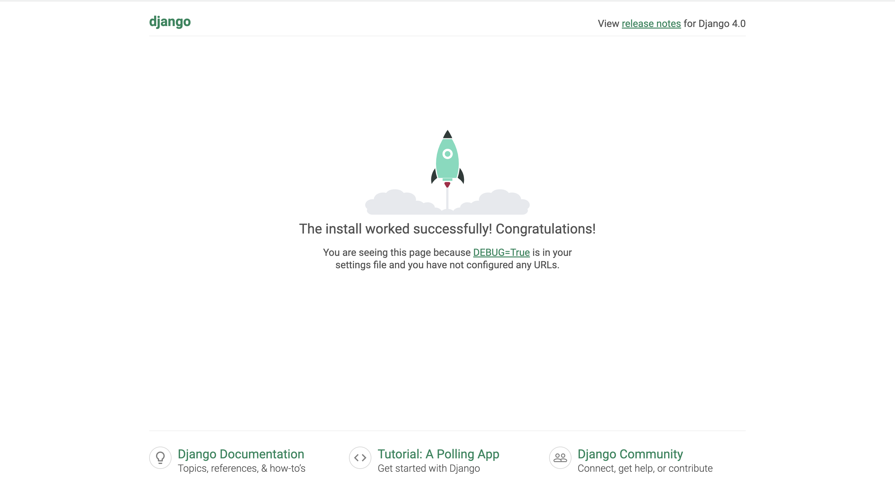

## DockerでDjangoとPostgreSQLの環境構築

ファイル構成を

~~~
$ tree -a
.
├── Dockerfile
├── docker-compose.yml
└── requirements.txt
~~~

この状態にする。ここでファイルの中身は

Dockerfile

~~~docker
FROM python:3
ENV PYTHONUNBUFFERED 1
RUN mkdir /code
WORKDIR /code
ADD requirements.txt /code/
RUN pip install -r requirements.txt
ADD . /code/
~~~

docker-compose.yml

~~~yml
version: "3"

services:
  db:
    image: postgres
    environment:
      - "POSTGRES_USER=postgres"
      - "POSTGRES_PASSWORD=postgres"

  web:
    build: .
    command: python manage.py runserver 0.0.0.0:8000
    volumes:
      - .:/code
    ports:
      - "8000:8000"
    depends_on:
      - db
~~~

requirements.txt（Pillowは画像扱うために入れているので、最小構成にするならいらない）

~~~
Django == 4.0
psycopg2
Pillow
~~~

として

~~~
$ docker-compose build
~~~

して

~~~
$ docker-compose run --rm web django-admin startproject myproject .
~~~

とするとファイル構成が

~~~
$ tree -a
.
├── Dockerfile
├── docker-compose.yml
├── manage.py
├── myproject
│   ├── __init__.py
│   ├── __pycache__
│   │   ├── __init__.cpython-310.pyc
│   │   ├── settings.cpython-310.pyc
│   │   ├── urls.cpython-310.pyc
│   │   └── wsgi.cpython-310.pyc
│   ├── asgi.py
│   ├── settings.py
│   ├── urls.py
│   └── wsgi.py
└── requirements.txt
~~~

となればOK！
setting.pyのDATABASES部分を

~~~
DATABASES = {
    'default': {
        'ENGINE': 'django.db.backends.postgresql',
        'NAME': 'postgres',
        'USER': 'postgres',
        'PASSWORD': 'postgres',
        'HOST': 'db',
        'PORT': 5432,
    }
}  
~~~

に書き換えて

~~~
$ docker-compose up -d 
~~~

として`http://localhost:8000/`にアクセスしてこの画面が出れば環境構築完了。

## 参考
[Docker×Django×PostgreSQLの環境構築(備忘録)](https://zenn.dev/iroristudio/articles/0216072d2d1f24)

